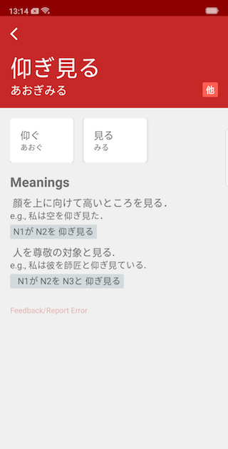
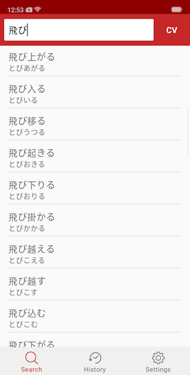

# Doushi (動詞)

Compound verbs (複合動詞) is an integral part of the Japanese language and hence is an important part in the journey of learning the language.

動詞 app is an useful interface over the [verb lexicon]() provided by the NINJAL (The National Institute for Japanese Language and Linguistics). Features like search history have been included to assist recollection & learning of Japanese language.

### Developement highlights
- Completely developed in Kotlin
- Used MVVM design pattern
- Offline database using Realm
- Extracted data from NINJAL's database into a plug-n-play Realm database

### Roadmap ahead
- Introduce Anki like flashcard memorisation technique
